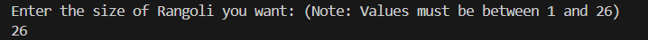
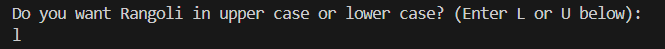
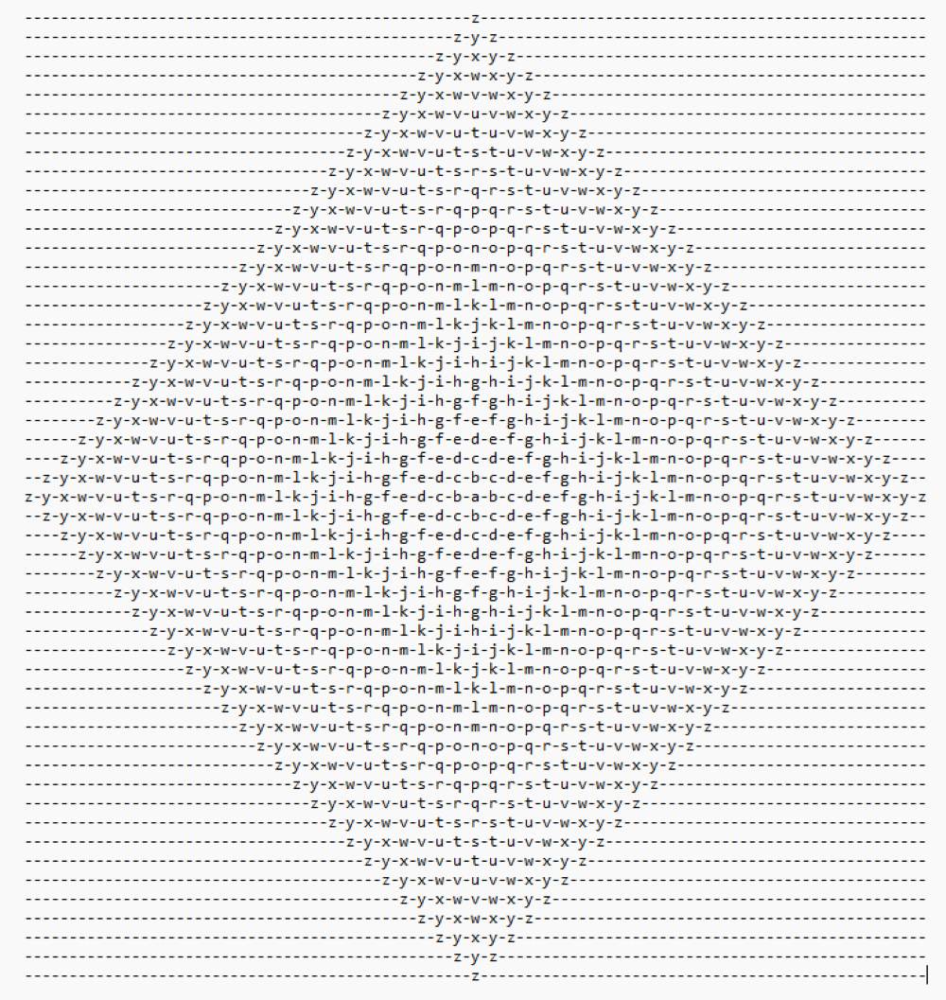

## Alphabet Rangoli
<h3>This app generates an <strong>Alphabet Rangoli</strong> based on your selected size and case (uppercase or lowercase).</h3>
## Features
<ul>
<li>Allows the user to create rangolis with both lowercase and uppercase alphabets.</li>
<li>Exception Handling<li>
<ul>
<li>If an invalid size is entered (outside the range of 1–26), the program provides feedback and asks the user to try again.</li>
<li>If an invalid case (not 'L' or 'U') is entered, the program prompts the user to enter a valid option.</li>
</ul>
</ul>
## How it works
<ul>
<li><strong>Input the size of the Rangoli:</strong> Enter a number between <strong>1 and 26</strong> (inclusive). The size determines how many rows the Rangoli will have.</li>
<li><strong>Select the case: </strong> Choose whether the Rangoli should be in <strong>uppercase</strong> or <strong>lowercase </strong>letters.</li>
</ul>
## Example Inputs:

## Example Output:
